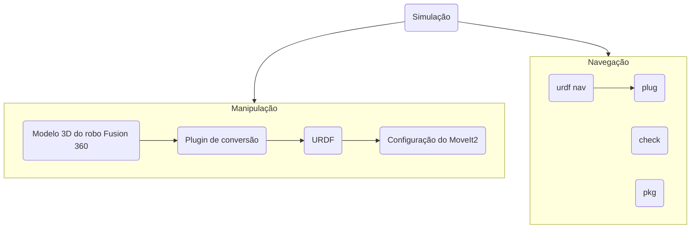

# TCC

# Proposta
Fazer a proposta do projeto

# Integrantes
- Gustavo Rosell  	- Eng. Automação e Controle 	- FEI
- Júlia Hernandes   - Eng. Elétrica               - FEI
- Lucas Lagoeiro  	- Eng. de Robôs			          - FEI
- Massiel Blandy	  - Eng. Automação e Controle   - FEI
- Thiago Moura  	  - Eng. Automação e Controle 	- FEI

# Processo de Desenvolvimento
